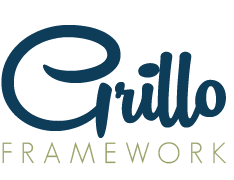

# Grillo Framework - A front-end framework for developing web applications.
[](https://travis-ci.org/vconnect/grillo)



Grillo is a front-end framework for developing web applications with a defined structure for organizing the various components that make up the project.

By calling it a front-end framework, it is not only just a framework containing HTML, CSS and JS files, but also one with a predefined set of tasks that are run by the [Grunt build system](http://gruntjs.com/). Grillo combines parts of frameworks, patterns and best practices to form a complete structure for creating web applications.

##Why Grillo?
After looking through all the available frameworks at the time of developing Grillo, there was no particular way of developing frontend assets that supports old browsers like Opera Mini and Internet Explorer 8. Most of the available frameworks that initially supported them have now completely dropped support for these browsers. As much as that idea doesn't sound bad, a good number of users from developing countries like Nigeria still make use of these old browsers and cannot be ignored in the development of websites. That's the problem that Grillo attempts to solve by making the experience in those old browsers acceptable while still giving better experiences to modern browsers without bloating the code.

##Setting up the development environment
To start development, you need to have a couple of tools installed on your system.

First of all, you need to get [NodeJS](http://nodejs.org/) on your system.
After installing it, you would also have npm installed.

Once you’ve installed Node.js, you can make sure you’ve got the very most recent version of npm using npm itself by running the following command in the terminal:

`sudo npm install npm -g`

(on Windows, you can drop the “sudo” but you should run it as administrator).

Next you need to install [Grunt](http://gruntjs.com/).
If you haven't used [Grunt](http://gruntjs.com/) before, be sure to check out the [Getting Started](http://gruntjs.com/getting-started) guide.

Install the CLI by running the following command: `npm install -g grunt-cli`. You may need to use sudo or install as an administrator.

Next you need to clone the git repository into a folder on your system.

```
git clone git@github.com:vconnect/grillo.git

cd grillo
```

Install the dependent node and grunt packages.

```
npm install
```

After this, you're all set to use the grunt system.

```
grunt
```

##Tests
You can test the JavaScript components of the framework by running the following command:

```
grunt test
```

##Troubleshooting and Useful tools
...

##Contributors
...

1. Fork it!
2. Create your feature branch: `git checkout -b my-new-feature`
3. Commit your changes: `git commit -am 'Add some feature'`
4. Push to the branch: `git push origin my-new-feature`
5. Submit a pull request :D

##License
See [LICENSE](LICENSE) file.
